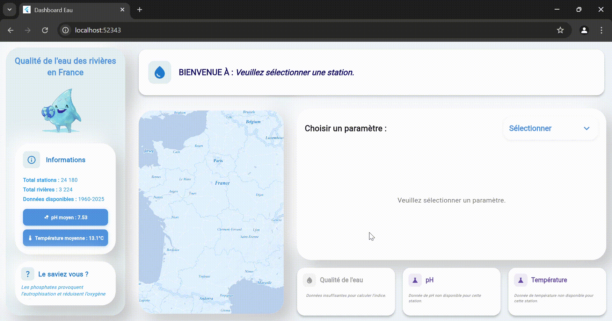

# Dashboard_Eau

Ce projet est un **dashboard interactif** permettant de visualiser en temps réel la **qualité de l’eau des rivières et fleuves en France**, à partir des données ouvertes de l’API Hub’Eau.

<p align="center">
    
    <br />
    <i align="center">Exemple du choix et de la visualisation des données d'une station.</i>
</p>

## À propos du projet

Ce projet vise à rendre accessible et compréhensible la qualité des eaux de surface en France. Il utilise une interface moderne pour présenter les données de surveillance des rivières : températures, pH, nitrates, ammonium, etc., tout en évaluant un **indice global de pollution** basé sur l'**indice IQEau**.

L’objectif est de sensibiliser à l’état des milieux aquatiques et de fournir un outil d’analyse simple à destination du grand public comme des scientifiques.

## Fonctionnalités principales

- Interface graphique moderne développée avec **Flutter**.
- Cartographie interactive des stations de mesure avec **Mapbox**.
- Affichage en temps réel des paramètres physico-chimiques de l’eau.
- Calcul et affichage d’un **indice de qualité de l’eau (IQEau)**.
- Anecdotes informatives "Le saviez-vous ?" qui changent toutes les 7 secondes.
- Connexion directe à l’**API Hub’Eau** pour obtenir les dernières données disponibles.
- Graphiques dynamiques des mesures par station.


## Technologies utilisées

<div align="center">
  
  
  
  
  
  
</div>


## Installation

Avant d’utiliser ce projet, assure-toi d’avoir Flutter installé sur ta machine. Pour cela, suis les instructions sur : [flutter.dev](https://flutter.dev).

### Cloner le dépôt

```bash
git clone https://github.com/SIFFRINP/flutter_dashboard.git
cd flutter_dashboard
```

#### Installer les dépendances 
Notre programme utilise des dépendances présentes dans le fichier pubspec.yaml. Pour les installer, il faut run cette commande.
```bash
flutter pub get 
```

### Lancer l’application

Une fois que les dépendances sont installées, on run le programme avec cette commande.
```bash
flutter run
```

## Licence
- nopernin vlancelin klaragcv SIFFRINP 
